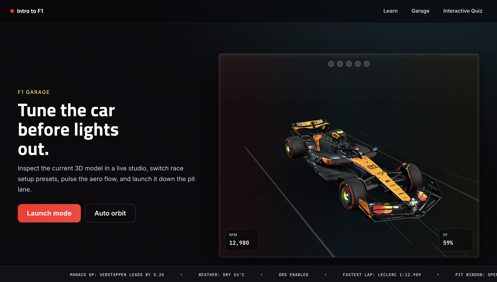
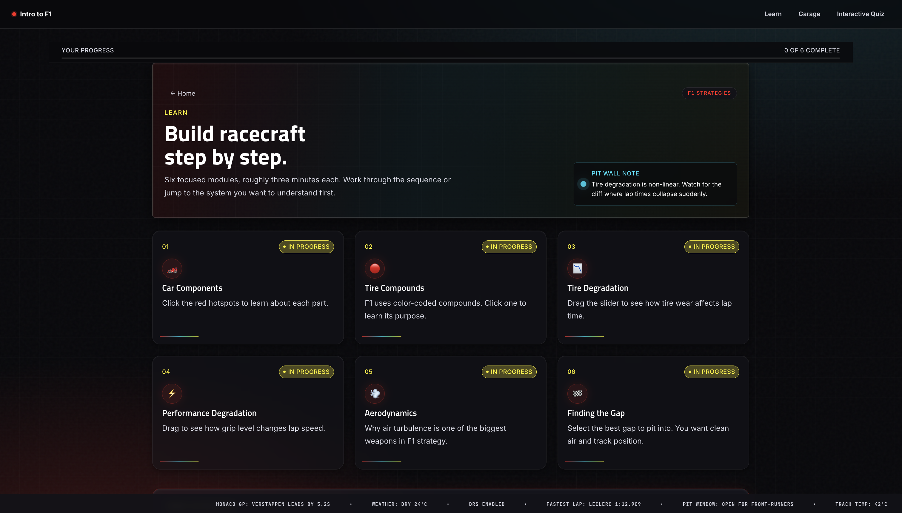
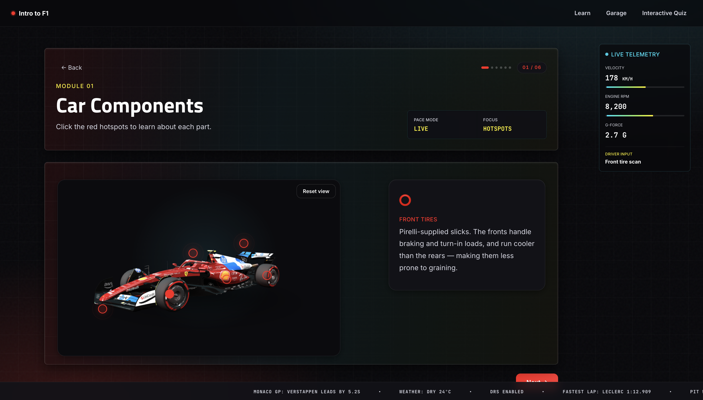
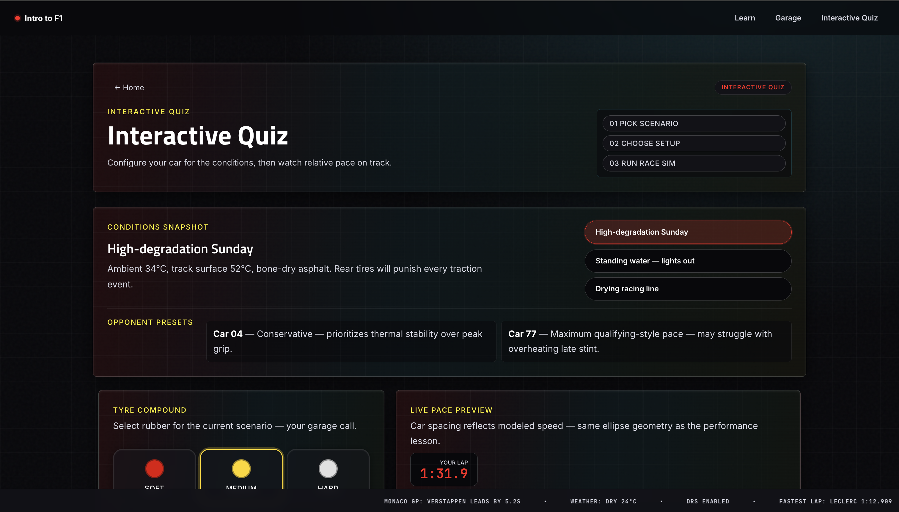
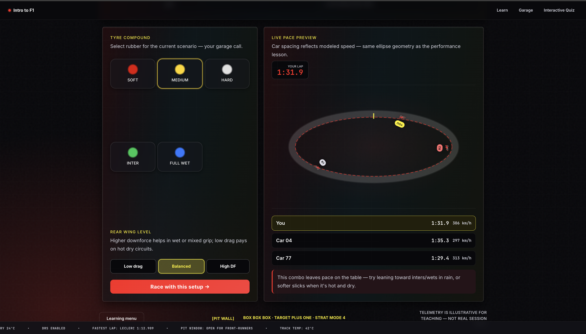

# Intro to Formula 1 — UI/UX Design Project

An interactive web app for learning Formula 1 race strategy. Built for our UI Design class (HW12).

Repository: `COMS4170W-UI-Design-F1-Project`

## What it covers

- **Car Components** — interactive 3D Ferrari SF-25 model with orbitable camera and clickable hotspots
- **Tire Compounds** — soft, medium, hard, intermediate, wet with explanations
- **Tire Degradation** — slider showing how lap times change as tires wear
- **Performance Degradation** — animated car on a track showing grip vs lap time
- **Aerodynamics** — clean air vs dirty air slipstream simulator
- **Finding the Gap** — interactive pit window selector
- **F1 Garage** — orbitable 3D model lab with selectable Ferrari, McLaren, Alpine, Mercedes, and Red Bull GLB cars, plus launch mode, setup presets, DRS, aero flow, and telemetry
- **Interactive Quiz** — configure tyre compound and rear wing for different weather scenarios, then compare modeled pace to rivals on a live track visualization

## Screenshots












## Run locally

```bash
python3 -m venv venv
source venv/bin/activate
pip install -r requirements.txt
python app.py
```

Then open **http://127.0.0.1:3000**.

## Routes

| Route | Purpose |
|---|---|
| `GET /` | Home — 3D hero car, start learning |
| `POST /start` | Record start, redirect to learning menu |
| `GET /learn` | Learning module menu |
| `GET /learn/<n>` | Lesson n (1–6), logs a view event |
| `POST /learn/<n>/interact` | Log an interaction as JSON |
| `GET /garage` | 3D garage — setup presets, launch mode, DRS and aero-flow controls |
| `GET /interactive-quiz` | Interactive Quiz — setup lab + pace preview |
| `POST /reset` | Clear the stored session |

## Data

Lesson content lives in `data/lessons.json`. Interactive Quiz scenarios live in `data/interactive_quiz.json`. Editing either file updates the app on refresh.

## Project layout

```
app.py                    # Flask app, routes, persistence
requirements.txt          # Flask
data/
  lessons.json            # 6 lessons of content
  interactive_quiz.json   # Interactive Quiz scenarios + metadata
docs/
  screenshots/            # README screenshots
templates/
  base.html               # shared layout (Bootstrap 5 + jQuery CDN)
  home.html               # / — hero + start
  learning_menu.html      # /learn — module list
  learn.html              # /learn/<n> — one lesson
  garage.html             # /garage — interactive 3D model lab
  interactive_quiz.html   # /interactive-quiz — setup + track preview
static/
  css/app.css             # F1 dark theme on top of Bootstrap, fully responsive
  js/car3d.js             # Three.js 3D car scenes (hero, lesson, victory lap)
  js/app.js               # lesson interactivity + ajax logging
  js/interactive_quiz.js  # Interactive Quiz simulation UI
  models/
    f1car.glb             # Ferrari SF-25 3D model (CC Attribution — Abu Saif)
    2025_mclaren_mcl39.glb
    2025_alpine_a525.glb
    2020_f1_mercedes_benz_w11.glb
    redbull_rb7.glb
  img/
    ferrari_home.jpg      # hero image fallback
    ferrari_sf24.jpg      # car components reference
storage/
  user_data.json          # single-user session state (git-ignored)
```

## Design Principles

This project applies core UI/UX principles throughout:

- **Visual Hierarchy** — Ferrari red (`#DC0000`) and racing yellow (`#FFF200`) as accent colors direct attention to primary actions and key data; secondary text uses a lighter grey to recede naturally.
- **Typography** — Titillium Web (Formula 1's real typeface) for headings paired with Inter for body copy. A fluid type scale using `clamp()` ensures readability across all screen sizes without hard breakpoints.
- **Consistency** — A single design token system (`--color-*`, `--fs-*`, `--r-*`, `--dur-*`) drives every component. Changing one token updates the entire UI consistently.
- **Feedback & Affordance** — All interactive elements (buttons, hotspots, tire cards) have visible hover/active states with color shifts, subtle lifts, and glow rings so users always know what's clickable.
- **Spacing & Breathing Room** — `clamp()`-based padding scales with the viewport. Cards use consistent radius (`--r-lg: 20px`) and elevation shadows to create clear depth layers.
- **Accessibility** — Semantic HTML throughout (`role="tab"`, `aria-selected`, `aria-live`), keyboard-navigable 3D car viewer, focus rings on all interactive elements, and `prefers-reduced-motion` support for animations.
- **Responsive Design** — Mobile-first breakpoints at 768px and 480px collapse multi-column grids, reflow navigation, and constrain canvas heights to keep the experience usable on any device.
- **Interactivity with Purpose** — Every interactive element (3D car, slipstream simulator, race setup lab) is tied to a learning objective, not decoration.

# Team Members

- Reya Vir — reyavir
- Dev Bahl — devbahl12
- Nitish Ramaraj — nitishramaraj

TA: Riya

## Repo

https://github.com/devbahl12/COMS4170W-UI-Design-F1-Project
